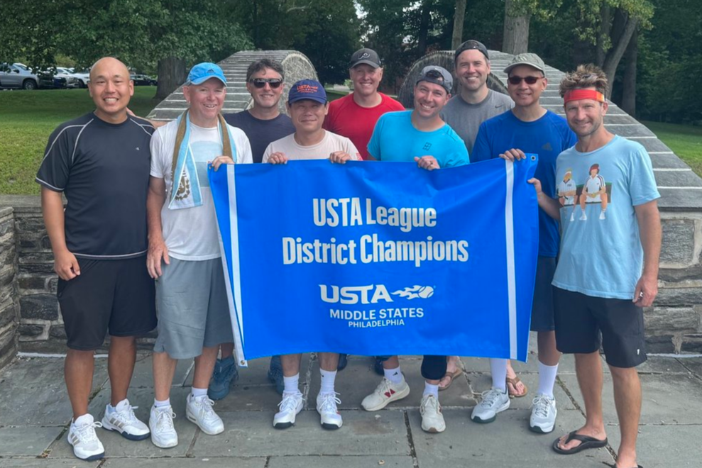
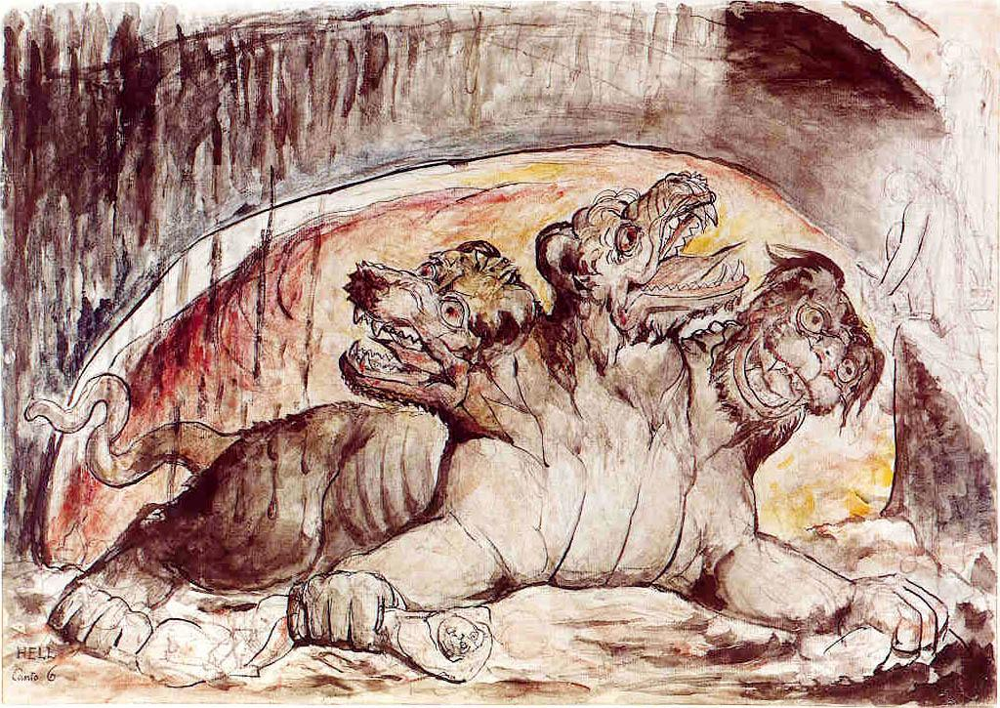

# Course Introduction, Review, and Introduction to ADT's

## CIS 211: Data Structures
#### Delaware Technical Community College
---

# Introductions

- About me
- About you
- About the course
---

# Me

<!-- column -->
- [LinkedIn: Jin An](https://www.linkedin.com/in/jinsungpsu/)
- Family
- Technology
- Sports (playing/watching)

<!-- column -->



---

# You

- Preferred name
- Major
- Memorable thing from break
- What makes you happy?
    - Hobbies? Favorite game/show/food?

---

# In case of emergency…

<!-- column -->

- Public Safety
- https://www.dtcc.edu/about/public-safety/
- Wilmington: (302) 552-5911

<!-- column -->


---

# Resources

- Alerts
    - https://dtcc.app.regroup.com/
- Student Support Center
    - https://www.dtcc.edu/support
- Students in Need
    - https://www.dtcc.edu/student-resources/need/
- Public Safety
    - https://www.dtcc.edu/about/public-safety

---

# Classroom Expectations


---

# Ground Rules


## Be respectful and professional

- Be respectful of your classmates and instructor.

## Focus on your goals

- Think about your goals for this course and your future career.
- Put yourself in the best position to succeed.

## Communicate early

- If something comes up, let me know as early as possible so we can work together on a solution.
---

# Scenarios

Common situations where communication matters:

- Need to miss class?
- Need to submit an assignment late?
- Have a conflict with an upcoming exam?
- Need to step out briefly?
- Expecting an important phone call?
- Have a question about the topic we're discussing?

---

# Course Communication

- D2L (announcements, sign up for notifications)
- Emails

---

# Communication Plan and Expectations

- preferred: jin.an@dtcc.edu (replies within 24 hours on weekdays)
- 302-223-9494 (text messages are OK, but don’t expect instant replies)
- https://calendly.com/jinandtcc
    - Appointments on Zoom, phone, or in person at WW363

---

# Class Format

- Lecture
- Discussion
- Coding demo
- Hands on coding
- Lab time

---

# Course Resources

- Github code repository
- Me
- You
- [Google](https://lmgtfy.app/?q=how+do+i+write+a+loop), Stack Overflow, YouTube, etc.

---

# What about generative AI (ChatGPT, Gemini, Meta AI, etc.)

<!-- column -->
- So what do you do with this technology?
- It's a tool
- In your context, it's a learning tool

<!-- column -->


---

# Academic Integrity

- [DTCC Student Handbook / Academic Integrity](https://dtcc.smartcatalogiq.com/Current/Catalog/Academics/Academic-Integrity)

---

# Most common in our department

- Cheating and Plagiarism

---

# Cheating

Cheating is an act of deception by which a student misrepresents that he or she has mastered information on an academic exercise that he or she has not mastered.

- Using and/or copying from another student's work such as test paper, project, or computer program.
- Allowing another student to copy one’s work.
- Using unauthorized materials such as a textbook, notebook, cell phone or other technology/materials during testing or competency performance without permission.
- Collaborating during a test or competency performance without permission.
- Using specifically prepared materials that are not permitted during a test.

---

# Plagiarism

Plagiarism is the inclusion of someone else's words, ideas, or data as one's own work.

- Whenever quoting another person's words.
- Whenever using another person's idea, opinion, or theory.
- Whenever borrowing facts, statistics, computer programs, or other illustrative materials unless the information is common knowledge.

---

# It's OK to work together!

- But you still have to write your own code
- No emailing whole programs
- No copy/paste
- Understand everything you are handing in
- When in doubt, cite and/or contact instructor

---

# What's the goal here?

- Learning!
- I am not here to "get you."
- I am not actively trying to find academic integrity infractions.

---

# Don't put yourself in that position...

- Students who cheat are often stressed and desperate because they waited too long to complete an assignment.
- Start your work early.
- Communicate with your instructor.

---

# Very obvious red flags

...

---

# Course Introduction

Welcome to CIS211

---

# Review in D2L Brightspace

- Homepage
    - Announcements

- Getting Started Module
    - Instructor info
    - Syllabus
    - Course policies
        - ***Late policy: 15% penalty per week, up to 2 weeks***
            - **If there are extenuating circumstances, communicate them ASAP**
    - Evaluation Measures & Grading Breakdown
    - Course Schedule

---

# Textbook

<!-- column -->

- Data Structures & Algorithm Analysis
    - Clifford A. Shaffer
    - [Shaffer Textbook Website](https://people.cs.vt.edu/shaffer/Book/)

<!-- column -->


---

# Technology

- IntelliJ Community Edition
- JDK

---

# What's This Course About?

---

# Three-Headed Monster

<!-- column -->
- Data Structures
- Algorithms
- Efficiency

<!-- column -->

---

# Data Structures

An organized way to store, manage, and retrieve data efficiently.

---

# Algorithms

Operations and procedures designed to:

- Search
- Sort
- Insert
- Delete
- Traversal

Later:

- Recursion
- Sorting algorithms

---

# Efficiency

- Time
    - How fast
- Space efficiency
    - How much resources are needed

---

# Java Review
## Review Topics

- Arrays
- CSV files
- ArrayList
- Java programming
- Control structures
- OOP

Resources:

- https://www.ktbyte.com/coder/pset/99/1/Hello-World
- https://www.w3schools.com/java/default.asp

---

# Be Honest With Yourself

<!-- column -->
### What are your goals?

- Short-term
- Long-term

### What topics need review?
<!-- column -->


---

# Arrays Review

- Syntax
- Iteration
- Memory allocation

---

# OOP Review

- Constructors
- Reference variables
- Objects
- Dot notation
- Private data
- Setters/Getters

---

# Files and CSV Review

- Scanner
- File
- next()
- nextLine()
- BufferedReader
- split()
- Data wrangling

---

# Practice

Find a CSV file.

Create a class representing one row.

---

# Example Dataset

Fun, beginner-friendly datasets
- https://www.kaggle.com/code/rtatman/fun-beginner-friendly-datasets

UFO Sightings
- https://www.kaggle.com/datasets/NUFORC/ufo-sightings

---

# UFO Sightings

What Is Each Row?
<pre>
First 2 Rows:
datetime,city,state,country,shape,duration (seconds),duration (hours/min),comments,date posted,latitude,longitude
10/10/1949 20:30,san marcos,tx,us,cylinder,2700,45 minutes,"This event took place in early fall around 1949-50. It occurred after a Boy Scout meeting in the Baptist Church. The Baptist Church sit",4/27/2004,29.8830556,-97.9411111
</pre>

- 1st row: Header row
- 2nd row: UFO sighting data 
---

# Data Fields

- datetime
- city
- state
- country
- shape
- duration
- comments
- latitude
- longitude

---

# UFO Sighting Class

<!-- column -->
- Data?
- Methods?
- Constructors?
- toString()?
- Other behaviors?

<!-- column -->
```java
class UFOSighting {
    private String city;
    ...
}
```
---

# First Row Example

- datetime: 10/10/1949 20:30
- city: san marcos
- state: tx
- country: us
- shape: cylinder
- duration: 2700
- latitude: 29.8830556
- longitude: -97.9411111

---

# Watch Out for Commas

## Problem:

What if commas occur inside quoted text?

Instead of:

```java
String[] data = line.split(",");
```

Use:

```java
String[] data =
    line.split(",(?=([^\"]*\"[^\"]*\")*[^\"]*$)");
```

<!-- footer -->
What is regex? https://en.wikipedia.org/wiki/Regular_expression

---

# Interact With the Data
Try writing some code to answer...
- How many sightings were in Delaware?
- Most common month?
- Most common year?
- Most common decade?
- Which state has the most sightings?

---

# Let's Create Another Class

UFOSightings

- Data?
- Methods?

Different than a single UFOSighting ...
- This is a collection of all the sightings
- Similar to the difference between `int` and `int[]`

---
# UFOSightings Class
```java
class UFOSightings {
    private ArrayList<UFOSighting> sightings;

    public String getStateWithMostSightings() {
        ...
    }

    public int getNumSightingsByState(String state) {
        ...
    }
}
```
---

# Introduction to ADTs
## Abstract Data Types

You should already know what these mean:

- Abstract
- Data Types

---

# Abstract

- Hiding unnecessary details
---

# Data Types

- A data type is a category of data that determines what values can be stored and what operations can be performed on those values.

<!-- column -->

Examples:

- int
- String

<!-- column -->
A data type combines:

- Data
- Operations

<!-- endcolumns -->
Examples:

```java
1 + 2

"Hello".length()
```

---

# Data Types and Classes

Think:

- What something is
- What something does

Includes:
- Instance variables
- public Methods

---

# Examples

- Cat
- Student
- Car
- Pokemon

These can all be viewed as data types.

---

# Abstract Data Type (ADT)

- Focus on public methods
- Focus on behavior
- Ignore implementation details

---

# Example List

```java
class List {

}
```

Possible operations:

- add
- remove
- size
- toString

---

# Implementation Details

Could be implemented many ways:

```java
int num1, num2, num3;
```

```java
int[] nums;
```

```java
ArrayList<Integer> nums;
```

Each design has consequences.

---

# Questions?