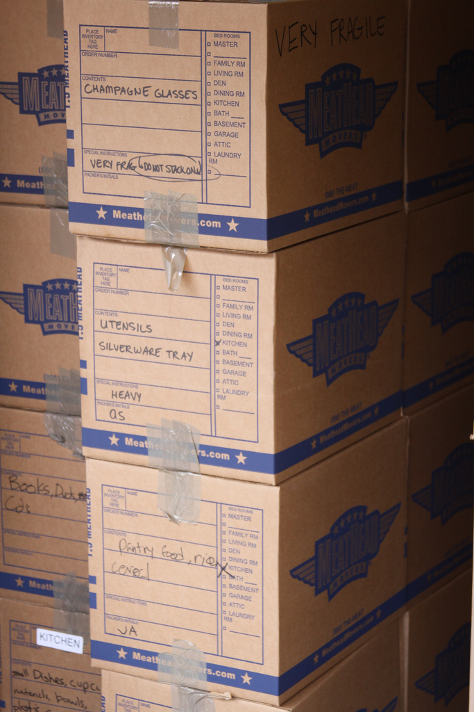
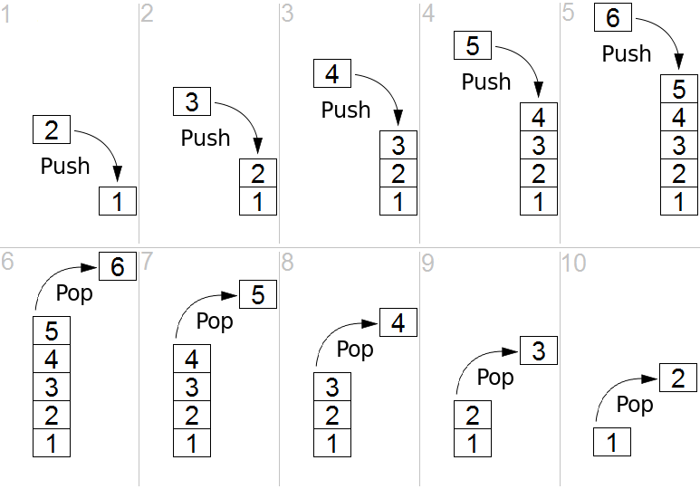
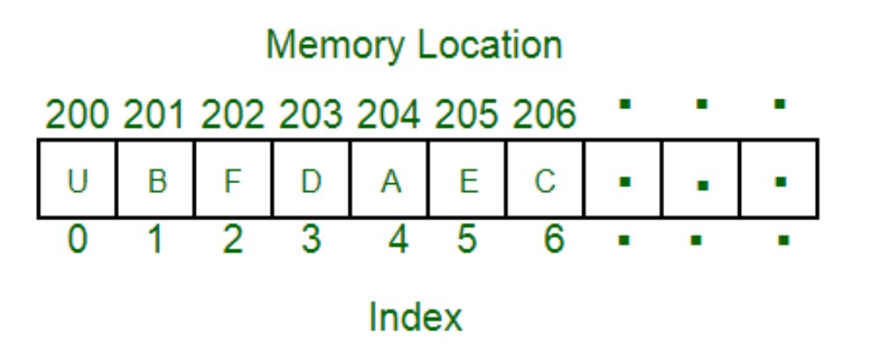

# Intro to Stack ADT and Array Implementation

---
# Balanced Brackets Problem

How would you program a solution to this problem?

Determine if (), {}, [] are balanced.

Examples:

```text
[()]{}{[()()]()}
=> Balanced

[(])
=> Not Balanced
```

<!-- column -->
Valid Example (balanced)

```text
((()))
```

<!-- column -->
Invalid Example (unbalanced)

```text
((())
```

---

# How Do We Solve This Problem?

To determine whether brackets are balanced, we need a way to:

- Remember opening brackets that have not yet been matched.
- Match each closing bracket with the **most recently unmatched** opening bracket.
- Process the symbols from left to right.

Before writing code, we should think about what operations are needed.

## Example

{ [ ( ) ] }

The ')' must match the most recent unmatched '(' before we can match the remaining brackets.

---

# Using an ADT to Solve Problems

An **Abstract Data Type (ADT)** focuses on:

- What data is stored.
- What operations are available.
- How the data is used.

An ADT helps us think about the solution before worrying about implementation details.

- Common ADTs include **Stacks**, **Queues**, **Lists**, and **Trees**.
- As we become familiar with these ADTs, we can choose the one that best fits a problem.
- The right ADT can simplify both program design and algorithm development.

These requirements closely match the operations of a **Stack ADT**.

---

# Full Solution Later
## For now... introducing our first ADT
Technically, arrays and lists are ADT's also
... so kind of the third ADT, but first formal/new ADT

---

# What is a Stack?

<!-- column -->

<!-- column -->

<!-- column -->


<!-- endcolumns -->
> ***Natural*** way of interacting with these... on the top

---

# Stack ADT

Data:
- Collection of items

Operations:
- push
- pop
- peek

> Not worried about ***implementation details*** just yet.

---

# Stack Operations

<!-- column -->
- push(item)
    - add to top
- pop()
    - remove from top
- peek()
    - inspect top
<!-- column -->

---
# Order of Operations

- FILO
    - first in, last out
- LIFO
    - last in, first out

> Same thing, different perspective
---
## Balanced Brackets Algorithm

```text
Create an empty stack

For each symbol in the expression

    If symbol is an opening bracket
        Push it onto the stack

    Else if symbol is a closing bracket

        If the stack is empty
            Return "Not Balanced"

        top = Pop from the stack

        If top does not match symbol
            Return "Not Balanced"

If the stack is empty
    Return "Balanced"
Else
    Return "Not Balanced"
```
---
# Interview Questions Using Stack
> Data structures and algorithms are common topics in technical interviews. Understanding ADTs, data structures, and problem

Some practice problems using stacks:
- https://www.geeksforgeeks.org/top-50-problems-on-stack-data-structure-asked-in-interviews/

All types of problems:
- https://leetcode.com/

---
# java.util.Stack
java.util.Stack documentation
- https://docs.oracle.com/javase/8/docs/api/java/util/Stack.html

---
# java.util.Stack

```java
Stack<String> stack = new Stack<>();

stack.push("CS1");
stack.push("CS2");

System.out.println(stack.peek()); // CS2
System.out.println(stack.pop());  // CS2
System.out.println(stack.isEmpty()); // false
```
---
# Array List and Array Stack
- Shaffer 4.1 General List
- Shaffer 4.1.1 Array List
- Shaffer 4.2 Stack
- Shaffer 4.2.1 Array Stack

---
# ADT Focus

- Use the Stack interface
- Implementation details remain hidden

---
# Arrays

- Fixed size
- Contiguous memory
- Random access

> ***Some of the most important concepts for the whole semester!***


---
# Fixed Size
- The size of an array is determined when it is created.
- You cannot add or remove elements later.
- Example: `int[] scores = new int[5];`
- This array will always store exactly 5 integers.

---

# Contiguous Memory

- Array elements are stored next to each other in memory.
- Because the elements are consecutive, the computer can quickly locate any element.

---

# Random Access

- Any element can be accessed directly using its index.
- The time required is the same whether the element is at the beginning, middle, or end of the array.
- Example:

```java
int[] scores = {85, 90, 78, 92, 88};

System.out.println(scores[3]); // 92
```

- The computer can jump directly to index `3` without checking the previous elements.

---
# Making the connection
- Stack is ADT
- Array will be *one possible implementation*

---
# Implementing a Stack Using an Array
<!-- column -->

| Array | Stack |
|--------|--------|
| Index 0: 5 | ← Top (5) |
| Index 1: 4 | 4 |
| Index 2: 3 | 3 |
| Index 3: 2 | 2 |
| Index 4: 1 | Bottom (1) |

<!-- column -->
| Array | Stack |
|--------|--------|
| Index 4: 5 | ← Top (5) |
| Index 3: 4 | 4 |
| Index 2: 3 | 3 |
| Index 1: 2 | 2 |
| Index 0: 1 | Bottom (1) |

---
# Activity
Which Implementation Would You Choose?  Suppose we frequently perform the following operations:

- `push(item)`
- `pop()`
- `peek()`

With a partner, discuss:

1. Which stack implementation would you choose?
2. Where would `push()` add a new element?
3. Where would `pop()` remove an element?

> Be prepared to explain **why** your choice might be more efficient.
---
# Which One Is Better?

Think about what happens when we:

- Add an item to the stack (`push`)
- Remove an item from the stack (`pop`)

Do either of the array-based implementations require shifting elements?
---
# Push/Pop Demonstrations

We will compare two ways to store a stack in an array:

1. **Top of stack at index 0**
2. **Bottom of stack at index 0**

Which implementation requires less work?
---
# Top of Stack with Index at 0

Initial stack:

| Index | 0 | 1 | 2 | 3 | 4 |
|---------|---|---|---|---|---|
| Value | 1 |   |   |   |   |

Stack: Top → 1
---
# push(2)

To place `2` on top, all existing elements must shift right.

| Index | 0 | 1 | 2 | 3 | 4 |
|---------|---|---|---|---|---|
| Value | 2 | 1 |   |   |   |

Stack: Top → 2, 1

---
# push(3)

Again, existing elements must shift right.

| Index | 0 | 1 | 2 | 3 | 4 |
|---------|---|---|---|---|---|
| Value | 3 | 2 | 1 |   |   |

Stack: Top → 3, 2, 1
---
# push(4)

| Index | 0 | 1 | 2 | 3 | 4 |
|---------|---|---|---|---|---|
| Value | 4 | 3 | 2 | 1 |   |

Stack: Top → 4, 3, 2, 1
---
# pop()

Removing the top item also requires shifting.

Before:

| Index | 0 | 1 | 2 | 3 |
|---------|---|---|---|---|
| Value | 4 | 3 | 2 | 1 |

After `pop()`:

| Index | 0 | 1 | 2 | 3 |
|---------|---|---|---|---|
| Value | 3 | 2 | 1 |   |

Every remaining element moves left.
---
# Compare with alternative
## Bottom of Stack with Index at 0

---
# Initial State
Bottom and top are both at index 0.

| Index | 0 | 1 | 2 | 3 | 4 |
|---------|---|---|---|---|---|
| Value | 1 |   |   |   |   |

Stack: Top → 1
---
# push(2)

Add the new item at the end.

| Index | 0 | 1 | 2 | 3 | 4 |
|---------|---|---|---|---|---|
| Value | 1 | 2 |   |   |   |

Stack: 1, 2 ← Top
---
# push(3)

| Index | 0 | 1 | 2 | 3 | 4 |
|---------|---|---|---|---|---|
| Value | 1 | 2 | 3 |   |   |

Stack: 1, 2, 3 ← Top
---

# push(4)

| Index | 0 | 1 | 2 | 3 | 4 |
|---------|---|---|---|---|---|
| Value | 1 | 2 | 3 | 4 |   |

Stack: 1, 2, 3, 4 ← Top

- No elements were shifted.
- We simply add the new item at the end.
- The top of the stack moves to index 3.
---

# pop()

Before:

| Index | 0 | 1 | 2 | 3 |
|---------|---|---|---|---|
| Value | 1 | 2 | 3 | 4 |

After `pop()`:

| Index | 0 | 1 | 2 | 3 |
|---------|---|---|---|---|
| Value | 1 | 2 | 3 |   |

No shifting required.
---
# Which One Is Better?

<!-- column -->

## Top = Index 0

- push() requires shifting
- pop() requires shifting
- More work as the stack grows

<!-- column -->

## Bottom = Index 0

- push() adds at the end
- pop() removes from the end
- No shifting required

<!-- endcolumns -->

Which implementation would you choose?  
*You don't have to answer, it's kind of a rhetorical question*

---
# ***Preferred*** Implementation

Why store the **bottom of the stack at index 0**?

- No element shifting
- Simpler implementation
- Faster push() and pop()
- `count` can track both the size and the next available position

This is the approach we will use for our ArrayStack implementation
---

# ***Preferred*** - not the **only** or **correct** implementation
- It's ONE way to implement a stack
- There are others
- Some are *better* than others in different ways

---

# Stack ADT and Array-Based Implementation

```java
interface Stack<T> {
    public void push(T item);
    public T pop();
    public T peek();
}

class ArrayStack<T> implements Stack<T> {
    private final int DEFAULT_SIZE = 10;
    private T[] stack;
    private int count;
}
```
---

# Demo
> In class demonstration working through examples and code live in class.

---

# Exceptions

You have already encountered exceptions such as:

```java
IllegalArgumentException
IllegalStateException
IndexOutOfBoundsException
```

- An exception is simply an object that represents an error condition.
- Java provides many built-in exception classes.
- We can create and throw exception objects when a problem occurs.

---

# Creating an Exception Object

The `throw` statement creates an exception object and stops normal execution.

```java
throw new IllegalStateException("Array is full!");
```

- `new` calls the exception's constructor.
- The constructor receives the error message.
- The exception object is then thrown.

---

# Why Throw an Exception?

Suppose a programmer tries to add an item to a full stack:

```java
stack.push(item);
```

As the designers of the class, we must decide what should happen.

Possible choices:

- Throw an exception
- Return an error value
- Ignore the operation

Different designs may make different choices.

---
---
# Following the Interface Contract

The interface, documentation, and comments often specify how a method must behave.

For example, the documentation may state:

- Throw an exception when an operation is invalid.
- Return a special value in certain situations.
- Handle errors in a specific way.

As programmers, we must follow those requirements.

---
# Assignment Requirements
In future labs and assignments, you may be required to throw specific exceptions.

- If the specification says to throw an exception and your code does not, the program is not behaving as required and **points may be deducted.**

- Always read the interface and documentation carefully before implementing a class.
---

# Design Decisions

```java
void push(T item) throws IllegalStateException
```

By throwing an exception:

- We clearly communicate that something went wrong.
- Invalid operations are not silently ignored.
- Programmers using our class can choose how to respond.

When creating our own classes, we often make these kinds of design decisions.

---

# Exceptions

```java
void push(T item) throws IllegalStateException;
```

- This method may throw an `IllegalStateException`.
- The exception occurs when the stack is in an invalid state for the operation.
- In our implementation, that state is a full stack.

---

# Throwing Exceptions

```java
void push(T item) throws IllegalStateException {
    if (count >= stack.length) {
        throw new IllegalStateException