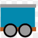
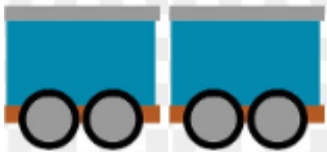
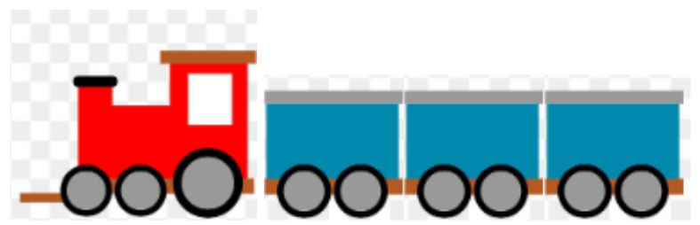
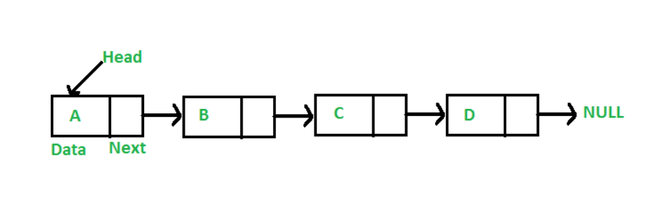
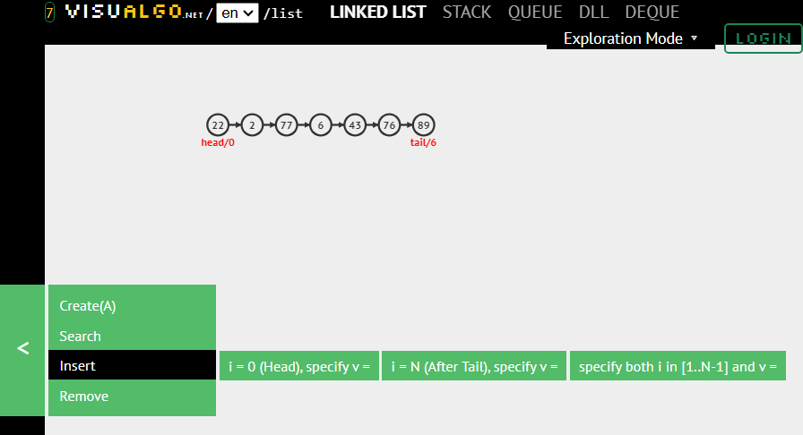
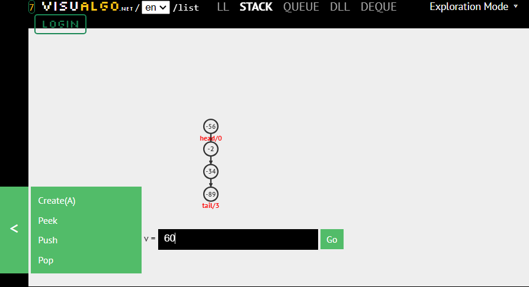
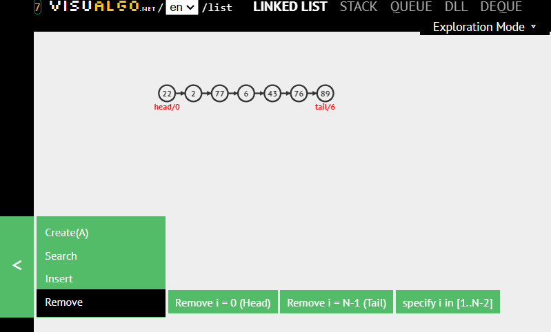
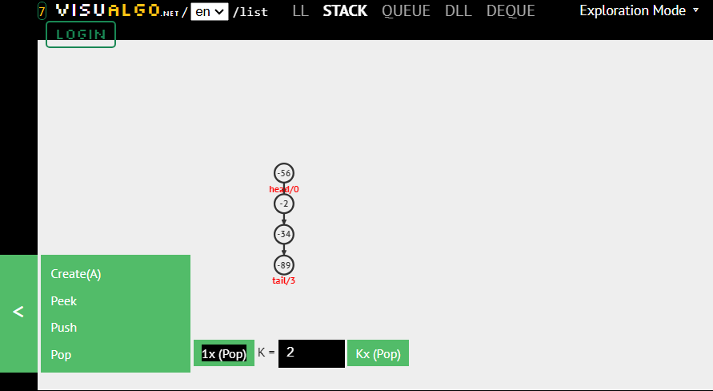

# Linked Node Implementation of Stack ADT
## Overview
- Reference Variables vs. Objects Review
- Linked Lists
- Implementing a stack with a linked list

---

# Reference Variables

Unlike primitive types, object variables are reference variables that point to where an object is stored.

```java
Car myCar;
```

This creates a reference variable, not an object.

---

# Null value

Reference variables can point to nothing.

```java
Car myCar = null;
```

---

# Creating objects

```java
new Car();
```

Typically:

```java
Car myCar = new Car();
```

---

# Assignment operator (=) with classes

```java
Car car1 = new Car();
Car car2 = new Car();
car1 = car2;
```

After assignment, both variables reference the same object.

---

# Garbage collection

Objects with no remaining references become garbage and may be automatically removed by the JVM.

---

# What happens if…

```java
class Car {
    private Car next;
}
```

---

# (Train) class object



---

# Two (train) class object

```java
Car car1 = new Car();
Car car2 = new Car();
```

<!-- column -->

<!-- column -->


---

# Two (train) class object connected together

```java
Car car1 = new Car();
Car car2 = new Car();
car1.next = car2;
```




---

# An abstract train



---

# Train class
<!-- column -->

<!-- column -->
- Each part of the train is an object
- All are constructed from the Car class
- However, we don't necessarily need to worry about individual cars, we only worry about the train
    - The train class keeps track of the first car, then the rest of the cars are connected to it

<!-- endcolumns -->
```java
class Train {
    Car firstCar;
}

class Car {
    Car nextCar;
}
```

---

# Train Class Code


```java

Train thomas = new Train();                 // One Train object represents WHOLE train
thomas.firstCar = new Car();                // Each car within the train needs to be constructed
thomas.firstCar.next = new Car();           // 2nd car
thomas.firstCar.next.next = new Car();      // 3rd car
thomas.firstCar.next.next.next = new Car(); // 4th car

```

---

# Linked List
## References

- Shaffer 4.1.2
- Shaffer 4.2.2

---

# Resizable

- Linked lists are ***mutable***.
- Can grow and shrink as needed.
- Do not require contiguous memory.

---

# Drawbacks

- Random access is difficult.
- Memory overhead exists for next references.
- Only the head node is directly tracked.

---

# Compared to Arrays…

| Arrays | Linked Lists |
|---|---|
| Random Access | No Random Access |
| No Memory Overhead per Element | Memory Overhead per Element |
| Immutable | Mutable |

---
# No Random Access

With an array, any element can be accessed directly using its index:

```java
scores[500]
```

With a linked list, nodes must be visited one at a time:

```text
Head → Node → Node → Node → ... → Target
```

To reach a node near the end of the list, we must follow the links from the beginning.

Arrays are faster when frequent index-based access is required.

---
# Memory Overhead per Element

Each array element stores only its data.

```text
[10][20][30][40]
```

Each linked list node stores:

- The data
- A reference to the next node

```text
[10 | •] → [20 | •] → [30 | •] → [40 | null]
```

The references require additional memory.

Linked lists use more memory than arrays to store the same number of values.

---
# Mutable

Arrays have a fixed size once they are created.

```java
int[] numbers = new int[5];
```

A linked list can be modified while the program runs.

We can:

- Add nodes
- Remove nodes
- Change the size of the list

This flexibility makes linked lists useful when the amount of data changes frequently.

---

# Linked List Diagram



<!-- footer -->
https://www.geeksforgeeks.org/data-structures/linked-list/

---

# Simple implementation…

- Similar to the Train class, but now renamed `Node` and saving actual data
    - Notice the data is using generic type `T`

```java
class Node<T> {
    T data;
    Node<T> next;
}

Node<Integer> head = new Node<>();
head.data = 1;
head.next = new Node<Integer>();
head.next.data = 2;
head.next.next = new Node<Integer>();
head.next.next.data = 3;
```

---

# Better implementation (Using Abstraction)

```java
class LinkedList<T> {
    Node<T> head;
}

class Node<T> {
    Node<T> next;
    T data;
}
```
---
# Why Create a LinkedList Class?

The previous example works, but it exposes all of the implementation details:

```java
head.next.next.data = 3;
```

The programmer must manually:

- Create nodes
- Link nodes together
- Keep track of the head node
- Traverse the list

This becomes difficult and error-prone as the list grows.

---
# Abstraction

A `LinkedList` class provides a higher-level abstraction that manages the nodes for us.

Instead of thinking about individual nodes, we can think about the list as a whole.

The name `LinkedList` also better describes what the object represents:

- A `Node` is one element in the structure.
- A `LinkedList` is the entire collection of elements.

Abstraction hides implementation details and makes code easier to use and maintain.

---

# Composition

A linked list is built from smaller objects called nodes.

```java
class LinkedList<T> {
    Node<T> head;
}
```

- A `LinkedList` **has a** `Node`.
- Each `Node` stores part of the list.
- Larger objects can be composed of smaller objects.
- This is called **composition**.

Think of a linked list as a chain and each node as a link in that chain.

---
# Nested Class

- The `Node` class is usually only used by the `LinkedList`.
- Because of this, it is often defined inside the `LinkedList` class.

<!-- column -->
```java
class LinkedList<T> {

    private class Node<T> {
        T data;
        Node<T> next;
    }

    private Node<T> head;
}
```
<!-- column -->
- `Node` is an implementation detail.
- Users of `LinkedList` do not need to work with nodes directly.
- Nesting helps hide implementation details.
- This supports **abstraction** and **encapsulation**.

<!-- footer -->
https://www.geeksforgeeks.org/linked-list-set-1-introduction/

---

# Why use nested classes?

- Logically group related classes.
- Increase encapsulation.
- Improve readability and maintainability.

<!-- footer -->
https://docs.oracle.com/javase/tutorial/java/javaOO/nested.html

---

# Null value

- Uninitialized reference variables are null.
- The last node's next reference is null.
> ***`next == null` identifies the tail.***

---
# java.util.LinkedList

Java already provides a linked list implementation:

```java
LinkedList<Integer> numbers = new LinkedList<>();

numbers.add(10);
numbers.add(20);
numbers.add(30);
```

Benefits:

- Well-tested and widely used
- Many built-in methods
- No need to write your own linked list from scratch

As programmers, we often use existing library classes instead of implementing common data structures ourselves.

---
# What's the Difference Between…

```java
List<Integer> numList1 = new ArrayList<>();
List<Integer> numList2 = new LinkedList<>();
```

Both variables use the same interface:

```java
List<Integer>
```

This is an example of **polymorphism**.

Benefits:

- We can write code using the `List` interface.
- The underlying implementation can change.
- The rest of the program may not need to be modified.

This allows us to focus on *what* the list does instead of *how* it is implemented.

---
# Which One Should We Use?

The answer depends on how the list will be used.
<!-- column -->
**ArrayList**

- Fast random access
- Less memory overhead
- Good when indexing is common
<!-- column -->
**LinkedList**

- Efficient insertion/removal near known locations
- Dynamic structure based on nodes
- More memory overhead
<!-- endcolumns -->

---
# Deeper Understanding
Even when using library classes, understanding how they work internally is important.

Knowing the underlying data structure helps us:

- Choose the appropriate implementation
- Predict performance
- Write more efficient programs

Abstraction hides implementation details, but understanding those details helps us make better design decisions.

---

# Abstract Data Type

- List is the ADT.
- ArrayList and LinkedList are implementations.
- Code interacts with both in the same way.

---

# Making the Connection
- Implementing the Stack ADT using a linked list
- Design decision required

---
# Stack Using a Singly Linked List

Suppose we want to implement a stack using a singly linked list.

```text
head
 ↓
+---+---+    +---+---+    +---+------+
| A | • | -> | B | • | -> | C | null |
+---+---+    +---+---+    +---+------+
```

Where should the **top of the stack** be?

- At the **head**?
- At the **tail**?

---
# Activity

With a partner, discuss:

1. Should the top of the stack be the **head** or the **tail**?
2. Where would `push()` add a new node?
3. Where would `pop()` remove a node?
4. Which choice would require less work?

> Be prepared to explain **why** your implementation is more efficient.

---
# Option A: Top at the Head

```text
TOP
 ↓
A -> B -> C -> null
 ^
head
```

Operations:

- `push(D)` adds a new node before `A`
- `pop()` removes `A`

Think about:

- How many nodes must be visited?
- Do we need to traverse the list?

---
# Option B: Top at the Tail

```text
head
 ↓
A -> B -> C
           ↑
          TOP
```

Operations:

- `push(D)` adds a node after `C`
- `pop()` removes `C`

Think about:

- How do we find the node before `C`?
- Can we move backward in a singly linked list?

---
# The Better Choice

Use the **head as the top of the stack**.

```text
TOP
 ↓
A -> B -> C -> null
 ^
head
```

Why?

- `push()` adds at the head
- `pop()` removes from the head
- No traversal is required

---
# Why Not the Tail?

```text
head
 ↓
A -> B -> C -> D
         ^
     must find
```

To remove `D`, we must first find the node before it.

Since a singly linked list only has `next` references:

- We cannot move backward.
- We must traverse from the head.

This requires extra work and makes the implementation less efficient.
---
# ***Preferred*** Implementation
Therefore, for a stack implemented with a singly linked list:

> Top of Stack = Head of List

---

# No random access!

- Operations nearer to the head are simpler.
- Linked structures track only one node directly.

---
# VisuAlgo Resource

VisuAlgo provides interactive visualizations for data structures and algorithms.

Use it to see operations performed step-by-step on various ADT's

We will use this resource throughout the semester to help visualize course concepts.

<!-- footer -->
https://visualgo.net/en/list

---

# Adding to a linked list



<!-- footer -->
https://visualgo.net/en/list

---

# Pushing to a stack



<!-- footer -->
https://visualgo.net/en/list

---

# Removing from a list



<!-- footer -->
https://visualgo.net/en/list

---

# Popping from a stack



<!-- footer -->
https://visualgo.net/en/list

---
# Iterating Through a Linked List

When working with a linked list, we move from node to node by following references.

```text
head
 ↓
[A] → [B] → [C] → [D] → null
```

Unlike an array, we cannot jump directly to an element using an index.

To move through the list, we follow each node's `next` reference.

---
# Traversal Variable

We typically create a temporary reference for traversing the list.

```java
Node<T> itr = head;
```

```text
head, itr
   ↓
[A] → [B] → [C] → [D]
```

- `head` remains unchanged.
- `itr` moves through the list.
- This allows us to examine nodes without losing the start of the list.

---
# Moving to the Next Node

To advance through the list:

```java
itr = itr.next;
```
<!-- column -->
Before:

```text
itr
 ↓
[A] → [B] → [C]
```

<!-- column -->
After:

```text
      itr
       ↓
[A] → [B] → [C]
```
<!-- endcolumns -->
Each assignment moves the traversal variable one node forward.

---
# Traversing a Known Number of Nodes

If we know how many positions to move:

```java
Node<T> itr = head;

for (int i = 0; i < count; i++) {
    itr = itr.next;
}
```

Pseudocode:

```text
Start at the head

Repeat count times
    Move to the next node
```

After the loop, `itr` points to the node that is `count` links away from the head.

---
# Finding the Last Node

Sometimes we need to continue until we reach the end.

```java
Node<T> itr = head;

while (itr.next != null) {
    itr = itr.next;
}
```

Pseudocode:

```text
Start at the head

While another node exists
    Move to the next node
```

This stops when `itr` references the last node in the list.

---
# Example

<!-- column -->
Initial list:

```text
head
 ↓
[A] → [B] → [C] → null
```
<!-- column -->
After one iteration:

```text
[A] → [B] → [C] → null
       ↑
      itr
```
<!-- column -->
After two iterations:

```text
[A] → [B] → [C] → null
              ↑
             itr
```
<!-- endcolumns -->
Now:

```java
itr.next == null
```

so `itr` is at the last node.

---
# A Common Traversal Pattern

Traversing a linked list is one of the most important operations we will use this semester.
<!-- column -->
```java
Node<T> itr = head;

while (itr != null) {
    // Process the data
    System.out.println(itr.data);

    itr = itr.next;
}
```
<!-- column -->
Pseudocode:

```text
Start at the head

While not past the end of the list
    Process the current node
    Move to the next node
```
<!-- endcolumns -->

This pattern appears in many linked-list algorithms.

---
# toString()

Most `toString()` methods follow this general structure:

```java
@Override
public String toString() {
    StringBuilder output = new StringBuilder();

    // Build the string here

    return output.toString();
}
```

The challenge is determining how to visit every node in the list and add its data to `output`.

---
# Pseudocode

```text
Create an empty StringBuilder

Create a traversal variable starting at the head

While the traversal variable is not null

    Add the current node's data to the output

    Move to the next node

Return the completed string
```

---
# Hints

Think about:

- How do we start at the first node?
- How do we move from one node to the next?
- What loop condition allows us to visit every node?
- How can we access the data stored in the current node?
- How should multiple values be separated?

<!-- column -->
Example output:

```text
[A, B, C]
```
<!-- column -->
or

```text
A -> B -> C
```
<!-- endcolumns -->
depending on the desired format.

---
# Common Mistakes

⚠️ Forgetting to move to the next node

```java
itr = itr.next;
```

Without this statement, the loop never ends.

⚠️ Modifying `head` instead of using a traversal variable

```java
Node<T> itr = head;
```

Use a temporary reference so the list structure remains unchanged.

⚠️ Stopping too early

Make sure every node is processed before the loop terminates.

---

# Interfaces

An interface defines a set of methods that a class must provide.

Interfaces describe **what** a class can do, not **how** it is implemented.

For example, different stack implementations may store data differently, but they can still provide the same operations:

- `push()`
- `pop()`
- `peek()`

<!-- footer -->
<a href="https://en.wikipedia.org/wiki/noopener noreferrer">https://en.wikipedia.org/wiki/Interface_(Java)</a>

---

# Capacity Restrictions?

Some stack interfaces include the method:

```java
void push(T item) throws IllegalStateException;
```

This means implementations may throw an exception when an item cannot be added.

For an **array-based stack**, this could happen if the stack is full.

For a **linked-list-based stack**, capacity restrictions generally do not apply because nodes can be added dynamically.

Different implementations may satisfy the same interface in different ways.
---
# What About the Exception?

```java
void push(T item) throws IllegalStateException;
```

Just because an exception appears in the interface does not mean every implementation must throw it.

For example:

- An array-based stack might throw the exception when the stack is full.
- A linked-list-based stack may never need to throw it.

The important part is that every implementation follows the interface contract.

As programmers, always check the interface and documentation to understand the expected behavior.
---
# Most Important Things to Remember

When comparing arrays and linked lists, focus on three key questions:

1. How quickly can we access an element?
2. How much memory is required?
3. How easy is it to change the size?

Tradeoffs are everywhere in Computer Science.

There is no "best" data structure.

The best choice depends on the operations your program performs most often.
---
# Arrays and Linked Lists

| Arrays | Linked Lists |
|---|---|
| Random Access | No Random Access |
| No Memory Overhead per Element | Memory Overhead per Element |
| Immutable | Mutable |

