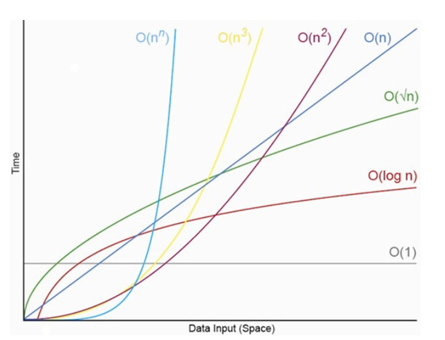
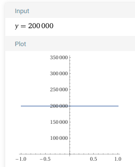
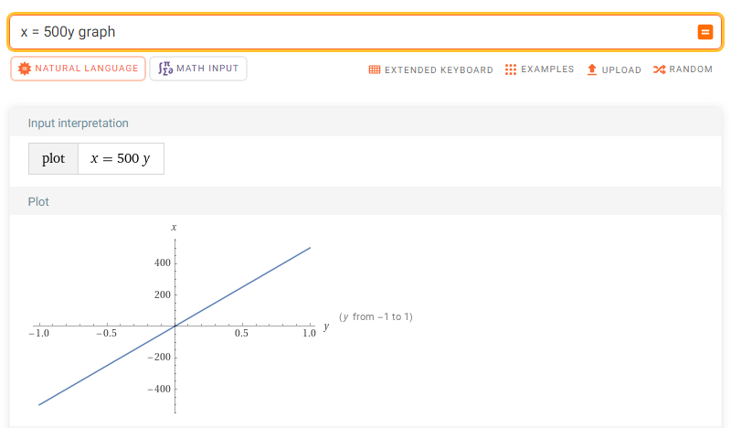
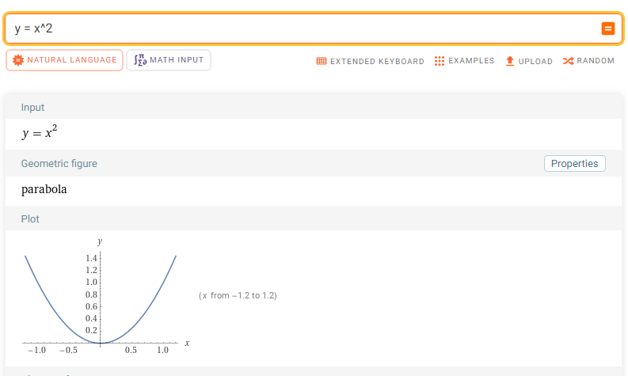

# Efficiency

---

# Big O Analysis

- Very basic introduction to algorithm analysis
- Time complexity (runtime growth)
- Space complexity (memory usage)
- Focus on behavior for sufficiently large inputs
- Learn to identify common complexity patterns
- Common vocabulary for comparing algorithms and data structures

---

# Why Study Big O?

Suppose a program searches a directory containing 800 Pokémon and takes 2 seconds.

How long would it take if the directory contained 8 million Pokémon?

**Answer: We cannot know yet.**

The answer depends on the algorithm.

---

# Big O, Big Omega, and Big Theta

- Big O: asymptotic upper bound
- Big Omega (Ω): asymptotic lower bound
- Big Theta (Θ): asymptotic tight bound

In this course, we will focus primarily on Big O.

---

# Big O Video


> [Big O Notation Video](https://www.youtube.com/watch?v=v4cd1O4zkGw)

---

# Why Do We Care?



As input sizes increase, small differences in growth rates become enormous differences in runtime.

---

# Common Growth Rates

| Complexity | Name |
|------------|------|
| O(1) | Constant |
| O(log n) | Logarithmic |
| O(n) | Linear |
| O(n²) | Quadratic |
| O(2ⁿ) | Exponential |

---

# What Does n Mean?

- Number of elements in an array
- Number of nodes in a linked list
- Number of records in a database
- Number of values being processed

Always determine what n represents before analyzing an algorithm.

---

# Constant Time: O(1)

<!-- column -->
The amount of work remains the same regardless of input size.

Examples:

```java
System.out.println(arr[0]);
```

```java
stack.peek();
```

```java
stack.push(item);
```

(assuming no resize is required and efficient implementation of peek and push)

<!-- column -->



---

# Constant Does NOT Mean Fast

Big O describes growth.

It does **not** describe exact execution time.

- Fast O(1)
- Slow O(1)

Both are still O(1).

---

# Linear Time: O(n)

<!-- column -->
Runtime grows proportionally with input size.

If the input doubles, the amount of work roughly doubles.

Common examples:

- Searching an unsorted array
- Traversing a linked list
- Printing every element in an array

<!-- column -->



---

# Linear Example

Searching an unsorted Pokédex:

- 800 Pokémon → 5 seconds
- 8,000 Pokémon → 50 seconds
- 80,000 Pokémon → 500 seconds

Every additional Pokémon may need to be checked.

Runtime: **O(n)**

---

# Searching for a Pokémon

```java
public static int findPokemon(String[] pokedex, String target) {

    for (int i = 0; i < pokedex.length; i++) {
        if (pokedex[i].equalsIgnoreCase(target)) {
            return i;
        }
    }

    return -1;
}
```

---

# Analyzing the Search

Worst case:

- Pokémon not found
- Pokémon is last element

For n Pokémon:

- Up to n comparisons

Runtime: **O(n)**

---

# Best, Average, and Worst Case

Best case:

- Pokémon is first
- O(1)

Average case:

- Somewhere near the middle
- O(n)

Worst case:

- Last item or missing
- O(n)

---

# Quadratic Time: O(n²)

<!-- column -->

Every element must interact with many other elements.

```java
for (int i = 0; i < N; i++) {
    for (int j = 0; j < N; j++) {
        System.out.println(i + "," + j);
    }
}
```

If N doubles, the amount of work grows by roughly four times.

<!-- column -->



---

# Exponential Time: O(2ⁿ)

The amount of work doubles whenever the input grows by one.

| n | Operations |
|---|---|
| 5 | 32 |
| 10 | 1,024 |
| 20 | 1,048,576 |

Exponential algorithms become impractical very quickly.

---

# Logarithmic Time: O(log n)

A logarithmic algorithm repeatedly reduces the amount of data remaining.

```text
1024
512
256
128
64
...
1
```

Each step cuts the problem approximately in half.

---

# Binary Search

Requirements:

- Data must be sorted

```text
3 5 8 12 15 18 20
```

Search for 15.

Check the middle value first.

---

# Why Binary Search is O(log n)

Each comparison eliminates about half the remaining data.

1024 → 512 → 256 → 128 → ...

Runtime: **O(log n)**

---

# Common Rules

- One loop → often O(n)
- Nested loops → often multiply
- Consecutive loops → add
- Repeated halving → O(log n)
- Ignore constants

---

# Ignoring Constants

```java
for(int i = 0; i < n; i++)
```

```java
for(int i = 0; i < 100 * n; i++)
```

Both are O(n).

---

# Simplifying Big O Expressions

O(n + n)

→ O(2n)

→ O(n)

---

# Simplifying Big O Expressions

O(n² + n)

→ O(n²)

---

# Simplifying Big O Expressions

O(n³ + n² + n)

→ O(n³)

---

# Multiple Variables

```java
for(int i = 0; i < n; i++) {
    for(int j = 0; j < m; j++) {
    }
}
```

Runtime: O(nm)

Not O(n²).

---
# Practice 1

Simplify:

## O(5n)

<p class="fragment">
Think for a moment:
</p>

<p class="fragment">
Does multiplying by 5 change the growth rate?
</p>

<p class="fragment">
If n doubles, does the algorithm still grow linearly?
</p>

<p class="fragment">
Step 1: Ignore constant multipliers.
</p>

<p class="fragment">
O(5n) → O(n)
</p>

<p class="fragment">
<strong>Answer: O(n)</strong>
</p>

---
# Practice 2

Simplify:

## O(n + 100)

<p class="fragment">
Which term matters most when n becomes very large?
</p>

<p class="fragment">
Compare:
</p>

<p class="fragment">
n = 100 → n + 100 = 200
</p>

<p class="fragment">
n = 1,000,000 → n + 100 = 1,000,100
</p>

<p class="fragment">
The constant becomes insignificant as n grows.
</p>

<p class="fragment">
O(n + 100) → O(n)
</p>

<p class="fragment">
<strong>Answer: O(n)</strong>
</p>

---
# Practice 3

<!-- column -->

Simplify:

## O(n² + n)

<!-- column -->

<p class="fragment">
Which term grows faster?
</p>

<p class="fragment">
n
</p>

<p class="fragment">
or
</p>

<p class="fragment">
n²
</p>

<p class="fragment">
Let's test:
</p>

<p class="fragment">
n = 10 → 100 + 10
</p>

<p class="fragment">
n = 100 → 10,000 + 100
</p>

<p class="fragment">
n² eventually dominates n.
</p>

<p class="fragment">
O(n² + n) → O(n²)
</p>

<p class="fragment">
<strong>Answer: O(n²)</strong>
</p>

---
# Practice 4

Simplify:

## O(3n² + 10n)

<p class="fragment">
First question:
</p>

<p class="fragment">
Can we ignore constant multipliers?
</p>

<p class="fragment">
O(3n² + 10n)
</p>

<p class="fragment">
↓
</p>

<p class="fragment">
O(n² + n)
</p>

<p class="fragment">
Now which term grows faster?
</p>

<p class="fragment">
n² or n?
</p>

<p class="fragment">
n² dominates.
</p>

<p class="fragment">
O(n² + n) → O(n²)
</p>

<p class="fragment">
<strong>Answer: O(n²)</strong>
</p>

---
# Discussion Question

Without calculating the answer immediately:

## Which grows faster?

- O(n²)
- O(n log n)
- O(n)

<p class="fragment">
Answer:
</p>

<p class="fragment">
O(n²) grows fastest.
</p>

<p class="fragment">
Ordering:
</p>

<p class="fragment">
O(n) → O(n log n) → O(n²)

---

# Actual Code Analysis 1

```java
for (int i = 0; i < N; i++) {
    System.out.print(myArray[i][0]);
}
```

<p class="fragment">O(n)</p>

---

# Actual Code Analysis 2

```java
System.out.print(myArray[0][0]);
```
<p class="fragment">O(1)</p>

---

# Actual Code Analysis 3

```java
for (int i = 0; i < N; i++) {
    for (int j = 0; j < M; j++) {
        System.out.print(myArray[i][j]);
    }
}
```

<p class="fragment">O(nm)</p>

---

# Actual Code Analysis 4

```java
for (int i = 0; i < N; i++) {
    System.out.println(myArray[i][0]);
}
for (int i = 0; i < M; i++) {
    System.out.println(myArray[0][i]);
}
```

<p class="fragment">O(n+m)</p>

---

# Actual Code Analysis 5

```java
for (int i = 1; i < N; i *= 2) {
    System.out.println(myArray[i][0]);
}
```

<p class="fragment">O(log n)</p>

---

# Let's Put Into Our Context: Question

What is the Big O time complexity of the stack ADT?

---

# Not a great question to ask!


---

# Why ADTs Have No Time Complexity

An ADT specifies behavior, not implementation.

Examples:

- Stack
- Queue
- List

An ADT does not specify implementation details.

---

# Better Question

What is the Big O time complexity of push in an ArrayStack?

---

# Push Method Analysis

```java
if (count >= stack.length) {
   throw new IllegalStateException();
}
stack[count] = item;
count++;
```
<p class="fragment">Runtime: O(1)</p>


---

# ArrayStack Pop

```java
public T pop() {
    return stack[--count];
}
```

<p class="fragment">Runtime: O(1)</p>


---

# ArrayStack toString

```java
for (int i = 0; i < count; i++) {
    output.append(stack[i]);
}
```

<p class="fragment">Runtime: O(n)</p>


---

# Array Resize Analysis

When resizing:

1. Create larger array
2. Copy items
3. Insert item

<p class="fragment">Resize runtime: O(n)</p>


---

---
# Amortized Analysis

Amortized analysis looks at the average cost of an operation over many executions.

Some operations may occasionally be expensive, but most are cheap.

When averaged together, the operation may still be efficient.

Example:

- Most ArrayStack pushes → O(1)
- Occasionally resizing the array → O(n)

Over many pushes:

**Amortized Runtime: O(1)**

---

# Amortized Analysis

Most pushes:

O(1)

Occasional resize:

O(n)

Average over many pushes:

**Amortized O(1)**

---

# Space Complexity

Time Complexity:

How long an algorithm runs.

Space Complexity:

How much memory an algorithm uses.

---

# O(1) Space

```java
int max = arr[0];
int index = 0;
```

Only a fixed number of variables are created.

---

# O(n) Space

```java
int[] copy = new int[n];
```

Memory usage grows with input size.

---

# Array vs Linked List

| Operation | Array | Linked List |
|-----------|--------|-------------|
| Access by index | O(1) | O(n) |
| Search | O(n) | O(n) |
| Insert at front | O(n) | O(1) |

---

# Common Student Mistakes

❌ O(n+n) = O(n²)

✅ O(n+n) = O(n)

---

# Common Student Mistakes

❌ Two loops always mean O(n²)

✅ Consecutive loops add

---

# Common Student Mistakes

❌ Big O predicts exact runtime

✅ Big O predicts growth

---

# Big O Cheat Sheet

| Complexity | Example |
|------------|---------|
| O(1) | Array access |
| O(log n) | Binary search |
| O(n) | Linear search |
| O(n²) | Nested loops |
| O(2ⁿ) | Brute force recursion |

---

# Review Questions

1. Why is binary search O(log n)?
2. Why is linear search O(n)?
3. Why can nested loops become O(n²)?
4. Why do ADTs not have time complexity?
5. What is amortized O(1)?
