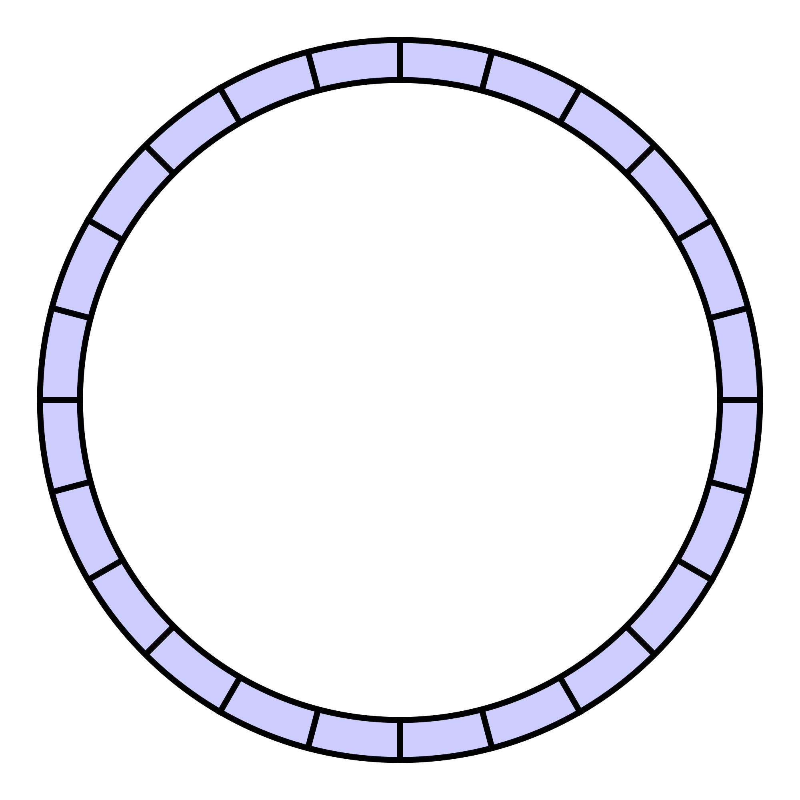

# Queue ADT

---

# What is a queue?

<!-- column -->


<!-- column -->


---

# Order

- First In First Out (FIFO)
- LILO (last in last out)?
    - Same concept viewed differently - but no one ever says LILO

---

# Queue Operations Summary

A queue provides a small set of operations that allow us to maintain **FIFO (First In, First Out)** order.

### Core Operations

**enqueue(item)**
- Adds a new item to the rear of the queue

**dequeue()**
- Removes and returns the item at the front of the queue

**peek()**
- Returns the front item without removing it

---
# Operations Example

Starting queue:

```text
Front → A  B  C ← Rear
```

`enqueue(D)`

```text
Front → A  B  C  D ← Rear
```

`dequeue()`

```text
Front → B  C  D ← Rear
```

`peek()`

```text
Returns B
Queue remains unchanged
```
---

# Queue Operations Key Idea

Queues are intentionally simple:

- Add at the rear
- Remove from the front
- Preserve FIFO order

<!-- footer -->
Remember: We can only directly access the front and rear of a queue.

---

# What Are Queues Useful For?

Anything where **FIFO (First In, First Out)** order is required.

<!-- footer -->
https://www.geeksforgeeks.org/applications-of-queue-data-structure/

---

# FIFO

A queue processes items in the same order they arrive:

1. First item added → first item removed
2. Second item added → second item removed
3. New items wait their turn at the back of the queue

---

# FIFO Example

Think of a line at a coffee shop:
- New customers join the back of the line
- The customer who has waited the longest is served first
- Nobody can skip ahead

---

# More FIFO Examples

Common real-world and computing examples:

- **Printer jobs**: Documents are printed in the order they are submitted.
- **Customer service lines**: The first customer in line is helped first.
- **Operating system scheduling**: Tasks may wait in a queue for CPU time.
- **Network routers**: Incoming packets are queued before transmission.
- **Web servers**: Requests may be placed in a queue when traffic is high.
- **Breadth-First Search (BFS)**: Uses a queue to visit nodes level by level.
- **Simulation systems**: Model waiting lines such as airports, banks, and restaurants.

---

# FIFO Key Idea

> Use a queue whenever **fairness, arrival order, or sequential processing** is important.

---
# Queues in Coding Interviews
 
Queues appear in many programming interview and coding challenge problems.
 
You do **not** need to memorize specific problems yet. Instead, learn to recognize situations where a queue is a natural fit.
 
A queue is often useful when:
 
- Items must be processed in the order they arrive
- Requests need to wait their turn
- Tasks are completed one at a time
- New work is added to the back while older work is handled first
- Fairness is important

---

# Queue in Java

> https://docs.oracle.com/javase/8/docs/api/java/util/Queue.html

- It's an interface!
    - What are the implementing classes?
---

# How to implement a Queue?

<p class="fragment">
Array
</p>

<p class="fragment">
Linked Nodes
</p>


---

# Pros and Cons of Each

## Arrays
- Random access
- Less overhead
- Immutable

## Linked Nodes
- More overhead
- No random access
- Mutable

---

# Array Implementation of the Queue ADT

---


# Array

One simple way to implement a queue is with an array.

Assume **index 0 is the front of the queue**.

| Index | 0 | 1 | 2 | 3 | 4 |
|---------|---|---|---|---|---|
| Value | A | B | C | D | E |

Queue view:

```text
Front → A  B  C  D  E ← Rear
```

---

# Operations:

- `dequeue()` removes **A** from the front
- `peek()` returns **A** without removing it
- `enqueue(F)` adds **F** to the rear

### Observation

The queue has a logical **front** and **rear**, even though it is stored in a simple array.

<!-- footer -->
Array indices and queue positions are not the same thing.
---

# Arbitrary...

Is index 0 the front or the back?   Actually, **either choice works.**

<!-- column -->
Option 1:

```text
Front → [0][1][2][3][4] ← Rear
```

<!-- column -->
Option 2:

```text
Rear → [0][1][2][3][4] ← Front
```

<!-- endcolumns -->

A queue only requires:

- Add at one end
- Remove from the other end
- Maintain FIFO order

> The computer does not care which end is called "front."

---

# Implementation Design Choice

The programmer simply needs to:

- Pick a convention
- Use it consistently
- Document the choice

For now, we will typically assume:

```text
Front = Index 0
Rear = Highest occupied index
```

---

# ADT Implementation

What problems arise when implementing a queue using an array?

Suppose we dequeue the front element:

Before:

| Index | 0 | 1 | 2 | 3 | 4 |
|---------|---|---|---|---|---|
| Value | A | B | C | D | E |

After `dequeue()`:

| Index | 0 | 1 | 2 | 3 | 4 |
|---------|---|---|---|---|---|
| Value |   | B | C | D | E |

---

# Problems

### Problem 1: Wasted Space

The empty position at index 0 cannot be used unless we do something about it.

### Problem #2: Shifting Elements

One solution is to shift everything left:

```text
B C D E
```

becomes

```text
Index 0 1 2 3
Value B C D E
```

---
# Shifting is Inefficient

> But shifting requires moving many elements.

- 1 dequeue might move several values
- Large queues become inefficient

### Discussion

If elements keep leaving the front and entering the rear:

- Empty spaces begin appearing
- Shifting is expensive
- We need a smarter solution

**Question:** How can we reuse the empty spots at the front without constantly shifting elements?

---

# Implications of operations on both ends

- Stacks use one end.
- Queues use opposite ends.
- Arrays may require shifting elements or wasting space.

---

# A Better Way - Circular Array!



<!-- footer -->
https://www.geeksforgeeks.org/circular-queue-set-1-introduction-array-implementation/

---

# Wrapping Around End of Array (length - 1)

Suppose we have an array of length 5:

| Index | 0 | 1 | 2 | 3 | 4 |
|---|---|---|---|---|---|

If our queue's rear is at index 4 and we add another element, we cannot move to index 5 because it does not exist.

Instead, we want to "wrap around" to index 0.

```text
0 ← 1 ← 2 ← 3 ← 4
↑                 ↓
└─────────────────┘
```

A circular array treats the end and beginning as connected.

---

# The Desired Wrapped Index

For an array of length 5:

| Index | 0 | 1 | 2 | 3 | 4 | 5 | 6 | 7 | 8 | 9 | 10 | 11 |
|---|---|---|---|---|---|---|---|---|---|---|---|---|
| Wrapped Index | 0 | 1 | 2 | 3 | 4 | 0 | 1 | 2 | 3 | 4 | 0 | 1 |

Notice the repeating pattern:

```text
0 1 2 3 4
0 1 2 3 4
0 1 ...
```

---

# Implementation

Assuming we keep track of the rear in a variable.

```java
rear++;

if (queue.length == rear) rear = 0;
```

- This works, but it requires an extra if statement every time we advance the index.
- (It's not a loop, so it's O(1), not O(n), but we could still think about how to improve it)

> Wouldn't it be nice if a mathematical operation could automatically produce the repeating pattern for us?

---

# Alternatively - use math!

## Modulo (%)

<!-- column -->

The result repeats in a cycle.

```text
1 % 2 = 1
2 % 2 = 0
3 % 2 = 1
4 % 2 = 0
```

<!-- column -->
Another example:

```text
0 % 5 = 0
1 % 5 = 1
2 % 5 = 2
3 % 5 = 3
4 % 5 = 4
5 % 5 = 0
6 % 5 = 1
```
<!-- endcolumns -->
### Observation

The results repeat through a fixed range.

This is exactly what we need for circular arrays.

---

# Any Value % Any Value...

```text
a % b
```

For positive values, the result is always in the range:

```text
[0, b - 1]
```

Examples:

```text
13 % 5 = 3
8 % 5 = 3
5 % 5 = 0
```

Since array indices run from:

```text
0 to array.length - 1
```

Modulo naturally produces valid array positions.

---

# % array.length

If an array has length 5:

```java
index = index % array.length;
```

then:

```text
0 → 0
1 → 1
2 → 2
3 → 3
4 → 4
5 → 0
6 → 1
7 → 2
```

The value stays within the legal index range and automatically wraps around.

---

# Wrapping Around at the End of the Array

Assume: array.length == 5

| Current Index | Next Index | Calculation |
|---|---|---|
| 0 | 1 | `(0 + 1) % 5` |
| 1 | 2 | `(1 + 1) % 5` |
| 2 | 3 | `(2 + 1) % 5` |
| 3 | 4 | `(3 + 1) % 5` |
| 4 | 0 | `(4 + 1) % 5` |

---

# Circular Movement

```text
0 → 1 → 2 → 3 → 4
↑                 ↓
└─────────────────┘
```

The rear index can continue increasing logically while modulo keeps the actual array index within bounds.

---

# Big picture summary so far…

## ADTs
- List
- Stack
- Queue

## Implementations
- Array
- SLL
- Circular Array
