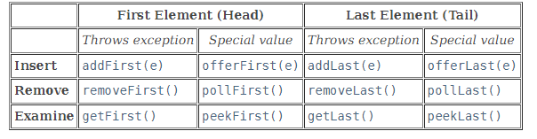

# Deque ADT Implemented Using an Array

---

# Double-Ended Queue
- Pronounced "deck"
- Queue adds on one side and removes from the opposite side
- Deque adds from both sides and removes from both sides

---

# Deque ADT

- `java.util.Deque`



<!-- footer -->
https://docs.oracle.com/javase/8/docs/api/java/util/Deque.html

---

# All Known Implementing Classes

- ArrayDeque
- ConcurrentLinkedDeque
- LinkedBlockingDeque
- LinkedList

---

# Uses of deques
- Browser history management
- Undo operations
- Breadth-first search (BFS)
- Task management systems
- Queueing systems
- Caching systems

<!-- footer -->
https://www.geeksforgeeks.org/applications-advantages-and-disadvantages-of-deque/

---

# Let's just use an array

- A circular array, since those are cool

---


# Wrapping Around End Index 0 (Negative Index)

Moving forward is easy.

What happens if we move backwards?

Suppose:

```java
front = 0;
```

We want the previous location to be:

```text
4
```

because:

```text
0 ← 1 ← 2 ← 3 ← 4
↑                 ↓
└─────────────────┘
```

However, moving backward introduces an issue with Java's modulo operator.

---

# Possible Solution

As before, we could use a simple if statement

```java
front--;
if (front == -1) front = deque.length - 1;
```

> Can we do it mathematically?

---

# Only Using % Length

Assume: length = 5

<!-- column -->
| Expression | Result |
|---|---|
| `0 % 5` | `0` |
| `1 % 5` | `1` |
| `2 % 5` | `2` |
| `3 % 5` | `3` |
| `4 % 5` | `4` |
| `5 % 5` | `0` |
| `6 % 5` | `1` |
| `7 % 5` | `2` |
| `-1 % 5` | `-1` |
| `-2 % 5` | `-2` |
| `-3 % 5` | `-3` |
| `-4 % 5` | `-4` |
| `-5 % 5` | `0` |

<!-- column -->
Example:

```java
(0 - 1) % 5
```

Result:

```java
-1
```

But `-1` is not a valid array index.

---

# Note

Java's modulo operator is technically a **remainder operator**.

Java preserves the sign of the left operand:

```java
-1 % 5 == -1
-2 % 5 == -2
```

Therefore:

```java
(0 - 1) % 5
```

does **not** wrap to 4.

This surprises many programmers the first time they implement a circular array.

---

# Fixing Negative Wraparound

A common solution is:

```java
(index - 1 + length) % length
```

Example:

```java
(0 - 1 + 5) % 5
```

```text
4 % 5 = 4
```

Now we correctly wrap from:

```text
0 → 4
```

without producing a negative index.

---

# Modulo in Other Languages

| Language / Definition | Example | Result |
|---|---|---|
| Java (remainder) | `-1 % 5` | `-1` |
| C | `-1 % 5` | `-1` |
| C++ | `-1 % 5` | `-1` |
| JavaScript | `-1 % 5` | `-1` |
| Python | `-1 % 5` | `4` |
| Mathematical modulo | `-1 mod 5` | `4` |

---

# Why Does This Matter?

A circular array implementation written in Python may work differently than the same code written in Java.

Always verify how `%` behaves in the language you are using.

### Takeaway

```java
(index + 1) % length
```

works great for moving forward.

For moving backward in Java:

```java
(index - 1 + length) % length
```

is usually the safest approach.

---

# Wrapping Around Negative Index

For negative values, we can add `array.length` after using `%`.

```java
wrappedIndex = (index % array.length) + array.length;
```

Example:

```java
index = -1;
array.length = 5;

wrappedIndex = (-1 % 5) + 5;
wrappedIndex = -1 + 5;
wrappedIndex = 4;
```

This gives us the index we wanted:

```text
0 ← 1 ← 2 ← 3 ← 4
↑                 ↓
└─────────────────┘
```
---

# Why It Works

When Java produces a negative remainder:

```java
-1 % 5 == -1
```

adding the array length moves the result back into a positive range:

```java
-1 + 5 = 4
```

```java
-2 + 5 = 3
```

```java
-3 + 5 = 2
```

This lets us wrap around to the end of the array instead of producing an invalid index.

---

# Using (index % array.length) + array.length

Assume: array.length = 5

| Original Index | Java Result (`index % 5`) | After Adding Length | Wrapped Index |
|---|---|---|---|
| -1 | -1 | 4 | 4 |
| -2 | -2 | 3 | 3 |
| -3 | -3 | 2 | 2 |
| -4 | -4 | 1 | 1 |
| -5 | 0 | 5 | 5 ⚠ |
| -6 | -1 | 4 | 4 |
| -7 | -2 | 3 | 3 |

---

# Notice a Problem

For:

```java
-5
```

we get:

```java
(-5 % 5) + 5
```

```text
0 + 5 = 5
```

But:

```text
5
```

is not a valid index in an array of length 5.

---

# Better Solution

To guarantee a valid index every time:

```java
((index % array.length) + array.length) % array.length
```

Example:

```java
((-5 % 5) + 5) % 5
```

```text
(0 + 5) % 5
= 5 % 5
= 0
```

---

# Takeaway

```java
(index % length) + length
```

fixes many negative values, but not all.

The fully safe circular-array formula is:

```java
((index % length) + length) % length
```

which always produces a value in the range:

```text
0 to length - 1
```

---
# Wrapping Around Both Ends
 
Suppose we want an index to wrap whether it becomes:
 
- Too large
- Negative
 
---

# Example

Array of length 5:
 
| Original Index | Desired Wrapped Index |
|---|---|
| 5 | 0 |
| 6 | 1 |
| 7 | 2 |
| -1 | 4 |
| -2 | 3 |
| -5 | 0 |
| -6 | 4 |
 
---

# Goal
 
No matter what value we start with, we want a valid array index:
 
```text
0 to 4
```
 
---
 
# Final Wrapped Index Formula
 
```java
wrappedIndex =
((index % array.length)
+ array.length)
% array.length;
```
 
This formula:
 
- Handles positive indices
- Handles negative indices
- Keeps the result within array bounds
- Always returns a valid array index

---
# Example
 
```java
index = -7;
array.length = 5;
```
 
```java
((-7 % 5) + 5) % 5
```
 
```text
(-2 + 5) % 5
= 3 % 5
= 3
```
 
Result:
 
```text
3
```
 
---
 
# Examples of the Final Formula
 
<!-- column -->
Assume: 
array.length = 5;
 
<!-- column -->
| Original Index | Wrapped Index |
|---|---|
| -7 | 3 |
| -6 | 4 |
| -5 | 0 |
| -4 | 1 |
| -3 | 2 |
| -2 | 3 |
| -1 | 4 |
| 0 | 0 |
| 1 | 1 |
| 2 | 2 |
| 5 | 0 |
| 6 | 1 |
| 7 | 2 |
 
---
# Key Idea
 
The formula converts **any integer** into a valid array index in the range:
 
```text
0 to array.length - 1
```
 
This creates true wraparound behavior in both directions.
