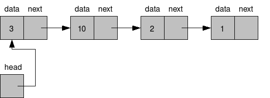
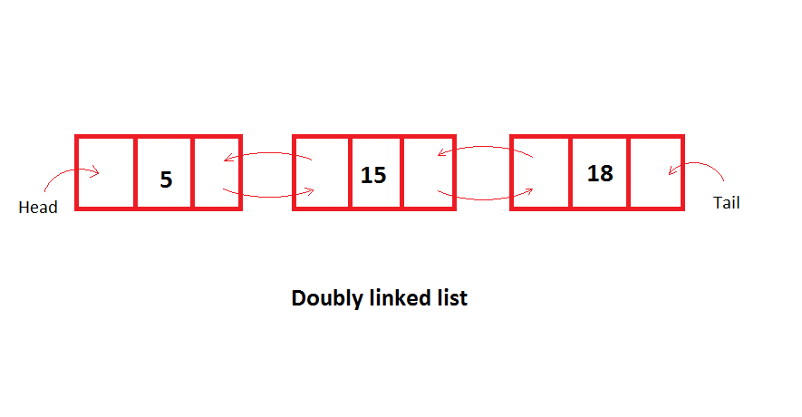
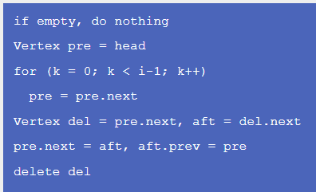
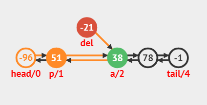
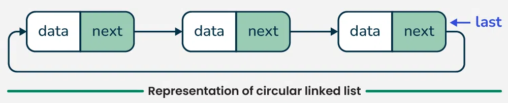
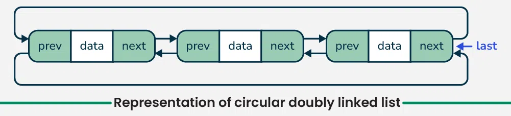

# Deque ADT Implemented with Linked Nodes

## Module Overview
In this lecture we will:
- Review why arrays are not always ideal
- Examine doubly linked lists (DLLs)
- See how deques benefit from DLLs
- Analyze common operations and their efficiency
- Introduce circular linked lists
- Compare ADTs vs. implementations

---

# Review: Arrays vs. Linked Lists

Data structures involve tradeoffs.

<!-- column -->

## Arrays
- Fixed-size structure
- Fast random access: `O(1)`
- Good cache performance
- Minimal memory overhead
- Expensive resizing

<!-- column -->

## Linked Lists
- Dynamic size
- Easy insertion/removal
- No random access
- Additional node references consume memory
- Traversal required to reach specific positions

---

# Pros/Cons of Arrays? They Stay the Same

The strengths and weaknesses of arrays do not change based on the ADT being implemented.

## Arrays
- Random access
- Compact memory usage
- Fixed size
- Insertions/removals often require shifting

## Linked Lists
- Dynamic growth
- Fast insertion/removal when location is known
- No random access
- Extra memory per node

---

# Why Consider a Linked Structure?

Think about queue and deque operations:

- Add to front
- Add to back
- Remove from front
- Remove from back

None of these require random access.

If we rarely access arbitrary indexes, linked structures become much more attractive.

---

# A Queue or Deque...

A deque primarily works at the ends of the structure.

- Random access provides little benefit
- Frequent insertion/removal is important
- Mutability becomes more valuable than indexing

This makes linked implementations a strong candidate.

---

# Using a Singly Linked List

A standard singly linked list has a limitation.

- Each node only knows its next node
- Usually only the head is maintained
- Reaching the tail requires traversal



---

# Why is This a Problem?

Consider removing from the back.

```text
Head -> A -> B -> C -> D
```

To remove `D`:

1. Start at the head
2. Visit A
3. Visit B
4. Visit C
5. Finally reach D

Time complexity:

```text
O(n)
```

This becomes inefficient for deque operations.

---

# Enter the Doubly Linked List

A doubly linked list solves this issue.

Instead of storing only a next reference:

```text
Previous <- Node -> Next
```

Each node can move:

- Forward
- Backward

This gives efficient access from both ends.

---

# Doubly Linked List Structure

<!-- column -->

References maintained by the list:

- Head
- Tail

Each node stores:

- Previous reference
- Next reference
- Data

<!-- column -->



---

# Visualizing a DLL

```text
null <- A <-> B <-> C <-> D -> null
         ^               ^
       head           tail
```

Benefits:

- Traverse in either direction
- Easy insertion at front
- Easy insertion at back
- Easy removal at front
- Easy removal at back

---

# DLL Implementation Details

```java
class DoublyLinkedList<T> {

    private Node head;
    private Node tail;

    private class Node {
        T data;
        Node prev;
        Node next;
    }
}
```

Notice that each node stores two references instead of one.

---

# Memory Tradeoff

The improved performance comes at a cost.

<!-- column -->

## Singly Node

```java
Node next;
```

One reference

<!-- column -->

## Doubly Node

```java
Node prev;
Node next;
```

Two references

<!-- endcolumns -->

More memory is used per node, but many operations become faster.

---

# Why DLLs Work Well for Deques

A deque needs efficient operations at both ends.

With head and tail references:

- Add front → `O(1)`
- Add back → `O(1)`
- Remove front → `O(1)`
- Remove back → `O(1)`

No traversal is required.

---

# Fast O(1) Operations on Both Ends

Typical deque operations:

```java
addFront()
addBack()
removeFront()
removeBack()
peekFront()
peekBack()
```

All can be performed in constant time with a DLL.

---

# Example: Add to Front

Before:

```text
head
 |
 A <-> B <-> C
```

Insert X:

```text
head
 |
 X <-> A <-> B <-> C
```

Only a few references need updating.

Complexity:

```text
O(1)
```

---

# Example: Remove from Back

Before:

```text
A <-> B <-> C <-> D
                 ^
               tail
```

After removing D:

```text
A <-> B <-> C
            ^
          tail
```

Again, only a few references change.

Complexity:

```text
O(1)
```

---

# Other Operations

Removing from the middle is more difficult.


<!-- column -->



<!-- column -->




<!-- footer -->
Visualgo
---

# Removing a Node in the Middle

General process:

1. Locate the target node
2. Access neighboring nodes
3. Disconnect the node
4. Connect neighbors together

Example:

```text
A <-> B <-> C <-> D
          ^
        remove
```

Result:

```text
A <-> B <-> D
```

---

# Algorithm for Removing in the Middle

- Find the node
- Determine which side is closer
- Traverse from head or tail
- Reach the target node
- Update neighboring references
- Orphan the removed node
- Decrease the size counter

The expensive part is finding the node.

---

# Time Complexity of Removing from the Middle?

Removing the node itself:

```text
O(1)
```

Finding the node:

```text
O(n)
```

Overall complexity:

```text
O(n)
```

The search dominates the operation.

---

# Visualgo Demonstration

Visualizing insertions and removals often makes linked structures easier to understand.

Explore:

- SLL operations
- DLL operations
- Insertions
- Removals
- Traversals

<!-- footer -->
https://visualgo.net/en/list

---

# Circular Linked Lists

A circular list connects the end of the structure back to the beginning.

Instead of ending with `null`, links wrap around.

```text
tail -> head
```

or

```text
head <- tail
```
depending on implementation.



---

# Circular Doubly Linked List

- Tail points to head
- Head points back to tail




---

# Why Use Circular Structures?

Possible advantages:

- Continuous traversal
- Convenient looping behavior
- Natural fit for round-robin scheduling
- Useful for playlists and turn-based systems

---

# Important Clarification

Circular lists do **not** automatically improve random access.

You still must traverse node by node.

Accessing the 500th element still requires visiting nodes.

```text
Random Access = O(n)
```

The circular connection simply changes how traversal behaves.

---

# Big Picture Summary So Far

## ADTs
- List
- Stack
- Queue
- Deque

## Possible Implementations
- Array
- Circular Array
- Singly Linked List
- Doubly Linked List
- Circular Singly Linked List
- Circular Doubly Linked List

An ADT defines behavior.

An implementation defines how that behavior is achieved.

---

# ADTs and Implementations

## Stack

Could be implemented with:

- Array
- Circular Array
- SLL
- DLL
- Circular SLL
- Circular DLL

---

# ADTs and Implementations

## Queue

Could be implemented with:

- Array
- Circular Array
- SLL
- DLL
- Circular SLL
- Circular DLL

---

# ADTs and Implementations

## Deque

Could be implemented with:

- Array
- Circular Array
- SLL
- DLL
- Circular SLL
- Circular DLL

Different implementations provide different performance tradeoffs.

---

# Key Takeaways

- Arrays provide fast random access.
- Linked lists provide flexibility and mutability.
- Deques benefit greatly from efficient end operations.
- Doubly linked lists support `O(1)` work at both ends.
- Removing from the middle still requires a search.
- Circular structures connect the ends together.
- ADTs describe behavior; implementations provide the mechanics.