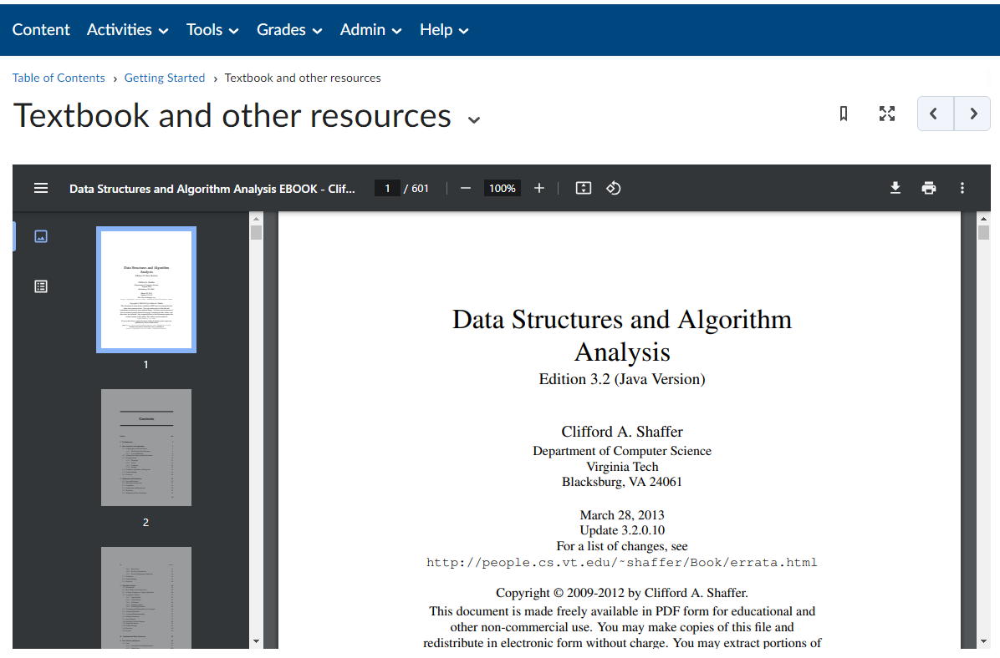
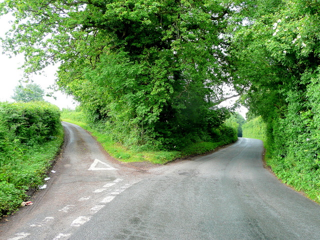

# Welcome to CIS211

## Data Structures

<!-- footer -->
[ Google Link ](https://google.com)
---

# Introductions

---

# Me

- https://www.linkedin.com/in/jinsungpsu/
- More about me not in LinkedIn:
- Family
- Technology
- Sports

Note:
- Speaker notes!

<!-- footer -->
[ Another Link ](https://google.com)
---

# You

- Preferred name
- Hobbies
- Goals
- Career?
- Other?

---

# Post a Picture... Any Picture...

Actually, maybe not **ANY** picture.

Keep it PG-13.

https://padlet.com/jindeltech/cis211sp26

---

# In Case of Emergency...

Public Safety

https://www.dtcc.edu/about/public-safety/

Wilmington: (302) 573-5418

---

# Resources

- Alerts
- https://dtcc.regroup.com/network/dtcc/preferences/profile
- Student Support Center
- https://www.dtcc.edu/support
- Students in Need
- https://www.dtcc.edu/student-resources/need/
- Public Safety
- https://www.dtcc.edu/about/public-safety

---

# Ground Rules

---

# Treat Each Other as Adults

- Be respectful
- Put yourself in the best position to succeed

Possible situations:

- Need to miss class?
- Late submitting an assignment?
- Conflict for an upcoming exam?
- Need to go to the bathroom?
- Expecting an important phone call?
- Have a question about the topic we're discussing?

---

# Course Communication

- D2L announcements
- Email

---

# Communication Plan and Expectations

- jin.an@dtcc.edu
- Replies within 24 hours on weekdays
- 302-223-9494
- Texts are OK
- https://calendly.com/jinandtcc
- Zoom, phone, or in-person appointments

---

# Class

- Syllabus
- Policies
- Grading breakdown
- Assignments overview
- Tentative schedule

---

# Class Format

- Lecture
- Discussion
- Coding demo
- Hands-on coding
- Lab time

---

# Course Resources

- GitHub repository
- Instructor
- Classmates
- Google
- Stack Overflow
- YouTube

---

# What About Generative AI?

<!-- column -->


<!-- column -->
- (ChatGPT, Gemini, Meta AI, etc.)

- It's a tool!
- In this class, it's a learning tool

---

# Academic Integrity

---

# Academic Integrity

https://dtcc.smartcatalogiq.com/Current/Catalog/Academics/Academic-Integrity

---

# Most Common in Our Department

Cheating and Plagiarism

---

# Cheating

Examples include:

- Copying another student's work
- Allowing others to copy your work
- Using unauthorized materials
- Unauthorized collaboration during testing
- Using prohibited notes or resources

---

# Plagiarism

Plagiarism is presenting someone else's words, ideas, or data as your own.

Cite sources whenever:

- Quoting
- Using another person's ideas
- Using statistics or programs
- Borrowing non-common knowledge

---

# It's OK to Work Together

- Write your own code
- No emailing complete programs
- No copy/paste submissions
- Understand everything you submit
- When in doubt, cite or ask

---

# What's the Goal Here?

- Learning!
- I'm not trying to "get you"

---

# Don't Put Yourself in That Position

Students who cheat are often:

- Overwhelmed
- Stressed
- Behind schedule

Start early.

Communicate.

---

# Very Obvious Red Flags

...

---

# Course Introduction

Welcome to CIS211

---

# Textbooks

<!-- column -->

- Data Structures & Algorithm Analysis
- Clifford A. Shaffer
- [Shaffer Textbook Website](https://people.cs.vt.edu/shaffer/Book/)

<!-- column -->



---

# Technology

- IntelliJ Community Edition
- JDK

---

# What's This Course About?

---

# The Three-Headed Monster

<!-- column -->
- Data Structures
- Algorithms
- Efficiency

<!-- column -->

---

# Data Structures

An organized way to store, manage, and retrieve data efficiently.

---

# Algorithms

Operations and procedures designed to:

- Search
- Sort
- Insert
- Delete
- Traverse

Later:

- Recursion
- Sorting algorithms

---

# Efficiency

Resource usage:

- Time efficiency
- Space efficiency

---

# Java Review

---

# Review Topics

- Arrays
- CSV files
- ArrayList
- Java programming
- Control structures
- OOP

Resources:

- https://www.ktbyte.com/coder/pset/99/1/Hello-World
- https://www.w3schools.com/java/default.asp

---

# Be Honest With Yourself

<!-- column -->
### What are your goals?

- Short-term
- Long-term

### What topics need review?
<!-- column -->


---

# Arrays Review

- Syntax
- Iteration
- Memory allocation

---

# OOP Review

- Constructors
- Reference variables
- Objects
- Dot notation
- Private data
- Setters/Getters

---

# Files and CSV Review

- Scanner
- File
- next()
- nextLine()
- BufferedReader
- split()
- Data wrangling

---

# Practice

Find a CSV file.

Create a class representing one row.

---

# Example Dataset

UFO Sightings

https://www.kaggle.com/code/rtatman/fun-beginner-friendly-datasets

https://www.kaggle.com/datasets/NUFORC/ufo-sightings

---

# What Is Each Row?
<pre>
First 2 Rows:
datetime,city,state,country,shape,duration (seconds),duration (hours/min),comments,date posted,latitude,longitude
10/10/1949 20:30,san marcos,tx,us,cylinder,2700,45 minutes,"This event took place in early fall around 1949-50. It occurred after a Boy Scout meeting in the Baptist Church. The Baptist Church sit",4/27/2004,29.8830556,-97.9411111
</pre>

---


A UFO Sighting.

Fields include:

- datetime
- city
- state
- country
- shape
- duration
- comments
- latitude
- longitude

---

# UFO Sightings

# UFO Sighting Class

- Data?
- Methods?
- Constructors?
- toString()?
- Other behaviors?

---

# First Row Example

- datetime: 10/10/1949 20:30
- city: san marcos
- state: tx
- country: us
- shape: cylinder
- duration: 2700
- latitude: 29.8830556
- longitude: -97.9411111

---

# Watch Out for Commas

Problem:

What if commas occur inside quoted text?

Instead of:

```java
String[] data = line.split(",");
```

Use:

```java
String[] data =
    line.split(",(?=([^\"]*\"[^\"]*\")*[^\"]*$)");
```

What is regex?

https://en.wikipedia.org/wiki/Regular_expression

---

# Interact With the Data

Questions:

- How many sightings were in Delaware?
- Most common month?
- Most common year?
- Most common decade?
- Which state has the most sightings?

---

# Let's Create Another Class

UFOSightings

- Data?
- Methods?

---

# Introduction to ADTs

---

# Abstract Data Types

You should already know:

- Abstract
- Data Types

---

# ADT vs Implementation

---

# Data Types

Examples:

- int
- String

A data type combines:

- Data
- Operations

Examples:

```java
1 + 2
```

```java
"Hello".length()
```

---

# Data Types and Classes

Think:

- What something is
- What something does

Includes:

- Fields
- Methods

---

# Examples

- Cat
- Student
- Car
- Pokemon

These can all be viewed as data types.

---

# Abstract Data Type (ADT)

- Focus on public methods
- Focus on behavior
- Ignore implementation details

---

# Example List

```java
class List {

}
```

Possible operations:

- add
- remove
- size
- toString

---

# Implementation Details

Could be implemented many ways:

```java
int num1, num2, num3;
```

```java
int[] nums;
```

```java
ArrayList<Integer> nums;
```

Each design has consequences.

---

# Questions?